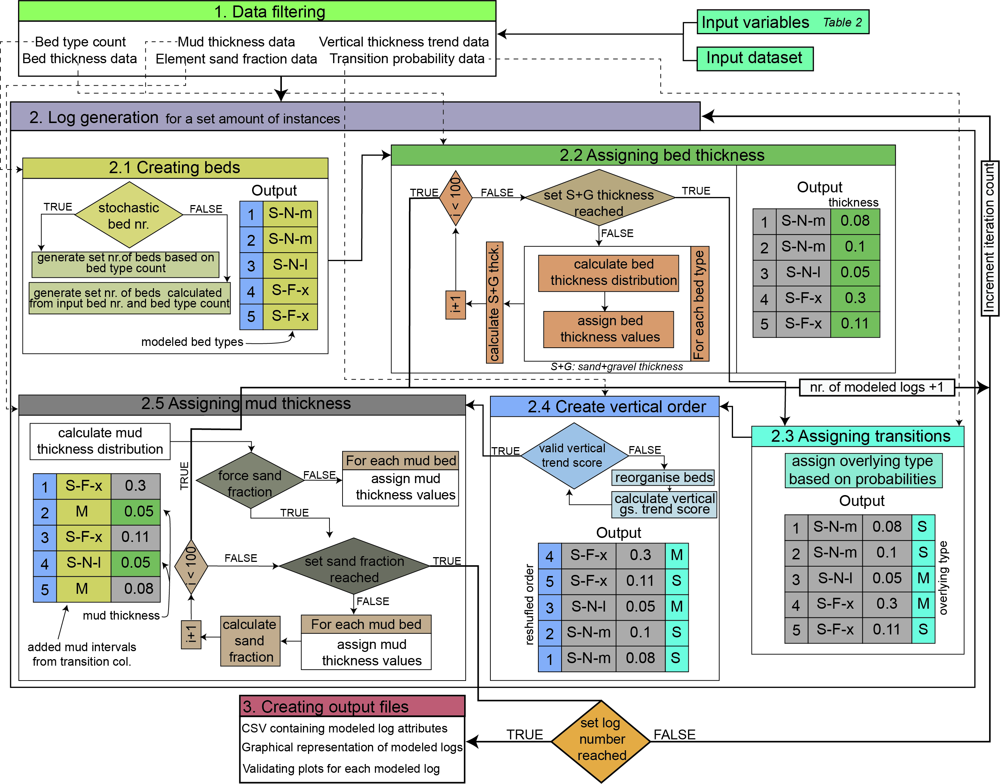

# Deep-Water Sedimentary Log Generator

2024-11-13

**Authors:** Budai, S., Colombera, L., McArthur, A. and Patacci, M.

contact: soma.budai@unipv.it

------------------------------------------------------------------------

This document explain how the algorithm presented in
`dw_sed_log_generator.R` works and how it generates synthethic
sedimentary logs depicting a selected deep-water architectural element.

Runtimes:

On a computer with the following specifications: i7-1360P 2.20 GHz, 32
GB RAM and Intel Iris Xe Graphics display adaptor on average generating
10 sedimentary logs without graphical input takes 3 seconds, with
graphical sedimentary log inputs 7 seconds, and with both graphical
outputs 15 seconds.

*Flowchart of the algorithm:*



### 1. Loading packages

``` r
library('MASS')
library(ggplot2)
library(dplyr)
library(ggpubr)
```

The script utilizes a series of packages, in order to manipulate
dataframes (`dplyr`), create plots (`ggplot2`) stitch plots together to
a single figure (`ggpubr`) and fit distribution on thickness data
(`MASS`).

### 2. Loading dummy dataset

The code is supplied with dummy datasets in the form of .csv files. Data
contained in these dummy datasets are utilized in the example
application of the script. If the script is opened separately not as
part of the R project provided path to the files should be changed.
Errors can be avoided by pasting the whole path to the files!

``` r
bed_data_dummy <- read.csv('DW_SLG/dummy_dataset/bed_data_dummy.csv', header = TRUE)
bed_transition_data_dummy <- read.csv('DW_SLG/dummy_dataset/bed_transition_data_dummy.csv', header = TRUE)
thickness_trend_dummy <-  read.csv('DW_SLG/dummy_dataset/thickness_trend_dummy.csv', header = TRUE)
sand_gravel_fraction_dummy <- read.csv('DW_SLG/dummy_dataset/sand_gravel_fraction_dummy.csv', header = TRUE)
mud_thickness_dummy <- read.csv('DW_SLG/dummy_dataset/mud_thickness_dummy.csv', header = TRUE)
```

### 3. Function

The script presents a function that is capable to generate one or
multiple synthetic sedimentary logs depicting a specified type of
deep-marine architectural element (terminal deposit, channel or levee).
The function returns a dataframe containing bedding information on the
generated log(s).

#### 3.1 Function parameters

The function operates with a series of input parameters that govern the
bedding properties of the generated logs for example the type of the
element, its cumulative sand thickness, bed count, etc. (see table
below). As the synthetic log generation is governed by geological
analogues it requires a set of input analogue data on bedding
properties, transitions, vertical thickness trends, mud thickness and
sand-gravel fraction. A suitable dummy dataset is provided in the
repository.

``` r
log_generator <- function(start_seed, iteration_number, 
                          include_logs = FALSE, include_validating_plots = FALSE,
                          input_bedding_data, 
                          input_transition_data, 
                          input_log_trend_data, 
                          input_mud_data, 
                          input_ng_data,
                          selected_sys_type = c('sandy system', 'gravelly-sand system'), 
                          selected_element, 
                          selected_climate = c('greenhouse', 'icehouse'), 
                          selected_period = c('-', 'Cambrian', 'Ordovician', 'Silurian', 'Devonian', 'Carboniferous', 'Permian', 'Triassic', 'Jurassic',
                                              'Cretaceous', 'Paleogene', 'Neogene', 'Quaternary'),
                          try_to_force_NG = FALSE,
                          selected_NG_value = NULL,
                          selected_NG_margin = 0.05,
                          stochastic_bed_frequency = TRUE,
                          include_SM_beds = TRUE,
                          include_G_beds = TRUE,
                          selected_sand_thickness,
                          selected_sand_thickness_margin = 0.5,
                          selected_bed_number = NULL
                          ) {...}
```


#### 3.2 Parameter default values and dataset filtering

The code filters the input datasets containing geological analogues
based on the input parameters.

``` r
 
  #FILTERING DATASET BASED ON INPUT VALUES
  
  filtered_bed_data <- input_bedding_data %>% 
    filter(element_general_type %in% selected_element) %>% 
    filter(climate %in% selected_climate) %>%
    filter(sys_gs_category %in% selected_sys_type) %>%
    filter(period %in% selected_period)
  
  
  if (nrow(filtered_bed_data) == 0) {
    stop('Filtering the bed table gave no result!')
  }
  
  transition_probabilities <- input_transition_data %>% 
    dplyr::select(code, overlying_ft, sys_gs_category, element_general_type, climate, period) %>%
    filter(element_general_type %in% selected_element) %>% 
    filter(climate %in% selected_climate) %>%
    filter(sys_gs_category %in% selected_sys_type) %>%
    filter(period %in% selected_period) %>%
    filter(overlying_ft %in% c('S','M','G')) %>%
    group_by(code, overlying_ft) %>% summarise(n = n())%>%
    ungroup() %>% group_by(code) %>% mutate(sum_n = sum(n)) %>% mutate(trans_prob = n/sum_n*100) %>% ungroup()
  
  if (nrow(transition_probabilities) == 0) {
    stop('Filtering the transition table gave no result!')
  }
  
  selected_vertical_bed_thickness_log_trend <- input_log_trend_data %>%
    filter(element_general_type %in% selected_element) %>% 
    filter(climate %in% selected_climate) %>%
    filter(sys_gs_category %in% selected_sys_type)
  
  if (nrow(selected_vertical_bed_thickness_log_trend) == 0) {
    stop('Filtering the vertical changes table gave no result!')
  }
  
  selected_mud_thickness_values <- input_mud_data %>%
    filter(element_general_type %in% selected_element) %>% 
    filter(climate %in% selected_climate) %>%
    filter(sys_gs_category %in% selected_sys_type) %>%
    filter(period %in% selected_period)
  
  if (nrow(selected_mud_thickness_values) == 0) {
    stop('Filtering the mud thickness table gave no result!')
  } 

  
  #calculate bed frequency based on inclusion or exclusion of certain beds
  
  if (include_SM_beds == TRUE & include_G_beds == TRUE) {
    selected_bed_frequency <- filtered_bed_data %>%
      group_by(code) %>% summarise(n = n()) %>% ungroup() %>%
      mutate(sum_n = sum(n)) %>% mutate(percent = n/sum_n*100)
  } else if (include_SM_beds == FALSE & include_G_beds == TRUE) {
    selected_bed_frequency <- filtered_bed_data %>%
      filter(gs_category != 'SM') %>%
      group_by(code) %>% summarise(n = n()) %>% ungroup() %>%
      mutate(sum_n = sum(n)) %>% mutate(percent = n/sum_n*100) 
  } else if (include_SM_beds == TRUE & include_G_beds == FALSE) {
    selected_bed_frequency <- filtered_bed_data %>%
      filter(!gs_category %in% c('G','sG','gS')) %>%
      group_by(code) %>% summarise(n = n()) %>% ungroup() %>%
      mutate(sum_n = sum(n)) %>% mutate(percent = n/sum_n*100)
  } else if (include_SM_beds == FALSE & include_G_beds == FALSE) {
    selected_bed_frequency <- filtered_bed_data %>%
      filter(!gs_category %in% c('G','sG','gS', 'SM')) %>%
      group_by(code) %>% summarise(n = n()) %>% ungroup() %>%
      mutate(sum_n = sum(n)) %>% mutate(percent = n/sum_n*100)
  } else {
    stop('Invalid include_SM_beds and/or include_G_beds value try TRUE or FALSE')
  }  
  
```

#### 3.3 Creating dataframes for report and sedimentary log generation

The next section of the code generates dataframes and lists that will be
populated by information on the generated logs and will be used in
graphical log generation (if this option is selected:
`include_logs == TRUE`)

``` r
  #GENERATE DATAFRAME THAT WILL BE POPULATED BY RESULTS
  column_names <- c('seed','selected system type','selected element', 'selected climate', 'force net-to-gross', 'selected net-to-gross',
                    'net-to-gross margin','modelled net-to-gross', 'stochastic bed frequency', 'selected bed number', 'selected sand thickness (m)',
                    'sand thickness margin', 'modelled sand thickness (m)', 'modelled mud thickness (m)', 'modelled element thickness (m)' , 'modelled sand-gravel fraction','vertical trend')
  
  report_df <- data.frame(matrix(ncol = length(column_names), nrow = 0))
  
  colnames(report_df) <- column_names
  
  
  #DATAFRAME THAT CONTAINS COLORS FOR LOG
  
#COLORS
  if (include_logs == TRUE | include_validating_plots == TRUE) { 
    colors_phi_df <- data.frame(
      code = c("G-N-m",    "G-N-l",    "G-N-x",    "gS-F-m",  "gS-F-x",   "gS-N-m",  "gS-N-x",   "gS-B-m",  "gS-C-m",  "gS-B-x",   "S-N-m",   "S-N-l",    "S-N-x",    "S-F-x",    "S-F-m",   
               "S-F-l", "S-B-x",    "S-B-m",   "S-C-m",   "S-C-x",    "S-C-l",    "S-B-l",    "sG-F-m",  "sG-N-m",  "sG-F-x",   "sG-N-l",   "sG-N-x",   "sG-B-m",  "sG-C-m",  "SM-N-m",  
               "SM-F-m",   "SM-N-l",   "SM-N-x",   "SM-B-x",   "SM-F-x",   "SM-C-l",   "SM-C-m",  "SM-C-x",   "SM-B-m",  "M"),
      color = c("#BA4E22",  "#BA6933",  "#C16D0D",  "#6787B2",  "#4C7BB1",  "#28649E",  "#005890",  "#064679",  "#113350",  "#10283E",  "#FFCC00",  "#F1C754",  "#EFE977",  
                "#2FAC66",  "#00A19A",  "#6EBD8D",  "#6A528C",  "#473781",  "#DC4541",  "#D60F3B",  "#AF1035",  "#EB5A6A",  "#6D8E40",  "#A6C176",  "#83A153",  "#CCE0A6",  
                "#A9C965",  "#E2D158",  "#FCD760",  "#74522D",  "#8A6538",  "#9E7745",  "#AE8A4F",  "#DDC08F",  "#7A6951",  "#DA9B73",  "#D4A155",  "#BE8B5E",  "#9DA27D",
                "#C5B9B8"),
      phi = c(5,    5,  5,  3,  3,  3,  3,  3,  3,  3,  3,  3,  3,  3,  3,  3,  3,  3,  3,  3,  3,  3,  4,  4,  4,  4,  4,  4,  4,  2,  2,  2,  2,  2,  2,  2,  2,  2,  2,  1)
    )
  }
  
  
  plot_list <- list() #this list will contain generated plots, needed to save them into one PDF
  
  validating_plot_list <- list() #this list will contain generated validating plots, needed to save them into one PDF
```

#### 3.4 Loop that generates a specified instances of sedimentary logs

As the next step, a while loop is initiated that generates a specified
amount of synthetic sedimentary logs (`iteration_count`) from a start
seed (`start_seed`) that governs random number generators, used to
ensure reproducibility. Each iteration utilizes a different seed number.
As sedimentary log generation can fail for example if the desired
sand-gravel thickness cannot be honored due to the low number of
generated beds. A while loop is used instead of a for loop. In the case
of failure at producing a realization (log), the number of total
iterations (`iteration_number`) is increased by one (see in later
section).

``` r
 seed <- start_seed-1
  iteration_count <- 0

  while (iteration_count < iteration_number) {
    seed <- seed+1
    iteration_count <- iteration_count+1
```

#### 3.4.1 Select bed number, sand thickness and sand-gravel fraction

Input parameters such as `selected_sand_thickness`,
`selected_bed_number` and `selected_NG_value` can be specified as a
range of values instead of a single integer value. The part of script
below detects whether a range of values were supplied. In positive
cases, the script randomly selects a value from the given range. If the
number of beds and sand-gravel fraction are not specified, the script
uses the mean values calculated from the input dataset of geological
analogues.

``` r
#SAND THICKNESS AND BED NUMBER: check if it is a single value or sequence of values  
    if (length(selected_sand_thickness) > 1) {
      set.seed(seed)
      input_sand_thickness <- sample(selected_sand_thickness, 1)
    } else {
        input_sand_thickness <- selected_sand_thickness
    }
      
    
    if (is.null(selected_bed_number)) {
      #if bed number parameter is not specified the script uses the average bed thickness to calculate bed number from the input sand thickness
      average_bed_thickness <- input_bedding_data %>% 
        filter(element_general_type %in% selected_element) %>% 
        filter(climate %in% selected_climate) %>%
        filter(sys_gs_category %in% selected_sys_type) %>%
        filter(period %in% selected_period) %>%
        summarise(mean_bed_thck = mean(bed_thickness)) %>% 
        pull(mean_bed_thck) %>% 
        as.numeric()
      
        input_bed_number <-  round(input_sand_thickness/average_bed_thickness, 0)
        
    } else if (length(selected_bed_number) > 1) {
        set.seed(seed)
        input_bed_number <- sample(selected_bed_number,1)
    } else {
        input_bed_number <- selected_bed_number
    }
    
    #NG value
    
    if (is.null(selected_NG_value)) {
      input_NG_value <- element_ng_thck_element_type %>% 
        filter(sys_gs_category %in% selected_sys_type) %>%
        filter(general_type %in% selected_element) %>% 
        filter(climate %in% selected_climate) %>%
        filter(period %in% selected_period) %>%
        summarise(mean_ng = mean(NG))%>% pull(mean_ng) %>% as.numeric()
      } else if (length(selected_NG_value) > 1) {
        set.seed(seed)
        input_bed_number <- sample(selected_NG_value,1)
      } else {
        input_NG_value <- selected_NG_value
      }
```

#### 3.4.2 Create beds

The script creates a set number of beds (`selected_bed_number`). The
type of the modelled beds can be determined using a random number
generator that samples a probability density function (PDF) of bed type
proportions measured on the filtered analogues dataset (if
`stochastic_bed_frequency` set to TRUE). As an alternative, the number
of occurrences of each bed type can be set to be proportional to the
overall frequency of each bed type (calculated from the filtered
dataset). However, if this option is chosen, bed-types that are less
frequent will only be present in generated log with a large enough
number of beds.

In both cases the modelled beds are contained in a list which is
appended to a dataframe: `combined_df`.

``` r
#BED NUMBERS
      
      #calculate the frequency of each bed type given the input parameters

      
      
    if (nrow(selected_bed_frequency) == 0) {
      stop('Filtering the bed table gave no result!')
    }
      
      #deterministic approach
      #calculate the percentage of each bed type based on the selected bed number
      
    if (stochastic_bed_frequency == FALSE) {
        
      bed_occurrence <- selected_bed_frequency %>% mutate(bed_type_n = round(input_bed_number * percent/100,0))  %>% 
        filter(bed_type_n !=0)
      # print(bed_occurrence)
      #GENERATE LIST IN WHICH BED TYPES ARE LISTED AS MANY TIMES AS THEIR OCCURRENCE CALCULATED ABOVE
        
      #list of bed types present in the modeled element
      present_bed_types <- bed_occurrence  %>% pull(code) %>% as.list()
        #number of each bed type present in the modeled element based on the input bed number
      present_bed_types_number <- bed_occurrence  %>% pull(bed_type_n) %>% as.list() 
      
      bed_list <- list()
        
      for (code_input in present_bed_types) {
          
        number_of_bed_type <- bed_occurrence %>% filter(code == code_input) %>% pull(bed_type_n)
        
        print(number_of_bed_type)
          
        for (i in 1:number_of_bed_type ) {
            
            bed_list[[length(bed_list)+1]] = code_input
        }
      }
      
      combined_df <- data.frame(code = unlist(bed_list))
      bed_list
    } else if (stochastic_bed_frequency == TRUE) {
        #stochastic approach
        
        bed_types <- selected_bed_frequency %>% pull(code) %>% as.list()
        bed_type_prob <- selected_bed_frequency %>% pull(percent) %>% as.list()
        
        set.seed(seed)
        random_bed <- sample(bed_types, input_bed_number , replace = TRUE, prob = bed_type_prob)
        combined_df <- data.frame(code = unlist(random_bed)) %>% arrange(code)
        bed_occurrence <- combined_df %>% group_by(code) %>% summarise(bed_type_n = n()) %>% ungroup()
        present_bed_types <- combined_df %>% distinct(code) %>% pull(code) %>% as.list()
        
    }
```

#### 3.4.3 Assigning bed thickness

As the next step the script assigns thickness values to the beds based
on thickness data from the filtered analogues and the desired
sand-gravel thickness (in meters) of the modelled log, with a margin of
error indicated by an input variable (`selected_sand_thickness_margin`
that has a default value of 0.5 m). For each bed type that is present in
the generated artificial log, a lognormal distribution is fitted on the
bed thickness values from the filtered input dataset. A lognormal
distribution is used as a default because it is generally considered as
a realistic approximation of the thickness distributions of beds
observed in outcrop.

A bed thickness value is assigned to each bed that builds up the
generated sedimentary log using random number generation based on the
properties of the respective calculated lognormal bed thickness
distribution. This bed thickness estimation is repeated until the
cumulative thickness of the beds falls within the range calculated from
the desired sand-gravel thickness and the error margin. As there are
cases when the desired sand-gravel thickness cannot be met (e.g., due to
imbalance between sand-gravel thickness and bed number), the code stops
assigning bed thickness values after 100 attempts and moves on to the
generation of the next log or terminates the process depending on
whether one or multiple logs are being generated.

Bed thickness values are appended to the dataframe (`combined_df`)
containing the modelled beds.

``` r
    #ADD BED THICKNESS
      
    selected_code_thickness <- filtered_bed_data %>%
      dplyr::select(code, bed_thickness)
    
    if (nrow(selected_code_thickness) == 0) {
      stop('Filtering the bed table for bed thickness gave no result!')
    }
    
    #initial values for while loop  
    sum_sand_thickness = input_sand_thickness-selected_sand_thickness_margin-1
    seed_thck = seed
    iteration_count_sand = 0
    
    while (!between(sum_sand_thickness,input_sand_thickness-selected_sand_thickness_margin,input_sand_thickness+selected_sand_thickness_margin)) {
        
      iteration_count_sand <- iteration_count_sand+1

      seed_thck <- seed_thck+1 
      if(iteration_count_sand == 100){
          
        if(iteration_number == 1) {
          stop(paste('Seed:',seed,'failed becasue:','Desired sand thickness wasnt reached within 100 iterations'))
        } else {
          print(paste('Seed:',seed,'failed becasue:','Desired sand thickness wasnt reached within 100 iterations'))
          break
        }
      }
        
      thickness_list <- list()
      
      for (bed_type in present_bed_types) {
        # print(bed_type)
        selected_thickness_data <- selected_code_thickness %>% filter(code == bed_type)
        code_mean_thickness <- mean(selected_thickness_data$bed_thickness)
        code_median_thickness <- median(selected_thickness_data$bed_thickness)
        # print(code_mean_thickness)
        fitted_distribution <- fitdistr(selected_thickness_data$bed_thickness, 'lognormal')
          
        meanlog <- fitted_distribution$estimate[['meanlog']]
        sdlog <- fitted_distribution$estimate[['sdlog']]
          
       
        sample_number <- bed_occurrence %>% filter(code == bed_type) %>% pull(bed_type_n) %>% as.numeric()
        
        # print(paste(bed_type,'sample',sample_number,'mean', meanlog, 'sd ',sdlog, sep = '  '))
        
        #there are cases where function fails to fit meanlog and sdlog, mostly due to low sample number
        #in this case for that bed type the mean thickness is used
        
        if (is.na(sdlog) | is.na(meanlog)) {
          random_bed_thickness <- rep(code_median_thickness,sample_number)
        } else {
          set.seed(seed_thck)
          random_bed_thickness <-  rlnorm(sample_number, meanlog,sdlog)
        }

        
          
        # print(paste(bed_type, random_bed_thickness, sep = '  ')) 
        thickness_list[[length(thickness_list)+1]] = random_bed_thickness
         
      }
      # print(thickness_list)  
      sum_sand_thickness <- sum(unlist(thickness_list))
      
    }
    
    #if while loop fails (sand thickness cannot be reached) the main for loop goes onto the generation of the next log
    if(iteration_count_sand == 100){
      # print(input_sand_thickness)
      # print(sum_sand_thickness)
      # print(input_bed_number)
      iteration_number <- iteration_number+1
      next
    }
    
    #add thickness values to the dataframe
    combined_df$thck <- unlist(thickness_list)
    modeled_thck_avg <- mean(combined_df$thck)
```

#### 3.4.4 Assigning overlying type

Transition probabilities for each bed type were used to determine
whether each output bed is overlain by another sand bed or by mud, using
a weighted random number generator, for which the weights are based on
the calculated transition probabilities (based on data from the provided
`input_transition_data` dataframe).

Overlying types are appended into a new column in the `combined_df`
dataframe.

``` r
#ADD MUD BEDS FROM TRANSITION PROBABILITIES

    random_trans_list <- list()
    for (bed_type in present_bed_types) {
      
        transition_probabilities_selected <- transition_probabilities %>% filter(code == bed_type)
        
        overlying_type <- transition_probabilities_selected %>% pull(overlying_ft) %>% as.list()
        probabilities <- transition_probabilities_selected %>% pull(trans_prob) %>% as.list()
        
        sample_number <- bed_occurrence %>% filter(code == bed_type) %>% pull(bed_type_n) %>% as.numeric()
        # print(sample_number)
        set.seed(seed)
        random_trans <- sample(overlying_type, sample_number, replace = TRUE, prob = probabilities)
        
        random_trans_list[[length(random_trans_list)+1]] = random_trans
        
    }
    
    #add transitions to the dataframe
    combined_df$trans <- unlist(random_trans_list)
```

#### 3.4.5 Order modelled beds based on thickness trend

As the next step, the modelled sand/gravel beds are rearranged so that
any vertical bed thickness trend that may be observed in the selected
input analogues is reproduced. To achieve this, firstly, the frequency
of upward thinning or upward thickening logs in the filtered dataset
(`input_log_trend_data`) are used together with a weighted random number
generator to determine whether the modelled log will display thinning or
thickening upward trends. Secondly, a while loop rearranges the bed
entries in the produced dataframe until the calculated ‘thickness trend
value’ falls within the range (minimum- maximum) of values of the
filtered analogue dataset.

The ’thickness trend value’ was calculated as follows: (i) the
difference between the thickness of each bed and the thickness of the
bed above was computed, considering both beds that are in direct
contact, as well as beds separated by mud intercalations; (ii) the total
sum of these differences was divided by the sum of the thickness of the
beds, to make the different logs comparable. If the calculated value was
positive (i.e. the magnitude and/or number of positive vertical
thickness changes outweighs the negative ones), then that specific 1D
representation of the element is defined as ‘thickening upward’; if the
value is negative the element is treated as ‘thinning upward’.

``` r
#ORDER BED TYPES
      
    #create probabilities for negative, zero and positive log_trend_value from log_vertical_bed_thickness
      
    #randomly order beds and calculate log_trend_value until value is within the experienced range
     
      
    selected_vertical_bed_thickness_log_trend_probability <- selected_vertical_bed_thickness_log_trend %>% filter(log_trend_value != 0) %>% group_by(log_trend) %>% summarise(n=n()) %>% ungroup() %>%
      mutate(sum_n = sum(n)) %>% mutate(probabilities = n/sum_n*100)
      
    log_vertical_bed_thickness_trends <- selected_vertical_bed_thickness_log_trend_probability %>% pull(log_trend) %>% as.list()
    
    log_vertical_bed_thickness_probabilities <- selected_vertical_bed_thickness_log_trend_probability %>% pull(probabilities) %>% as.list()
   
    #probabilities if the modeled log should be thinning of thickening upward
    set.seed(seed)
    random_thickness_trend <- sample(log_vertical_bed_thickness_trends, 1, replace = TRUE, prob = log_vertical_bed_thickness_probabilities)
    random_thickness_trend
    
    #min and max values if the log is thickening or thinning 
    if (random_thickness_trend == 'thickening') {
        log_trend_value_min <- 0
        log_trend_value_max <- max(selected_vertical_bed_thickness_log_trend$log_trend_value)
    } else if (random_thickness_trend == 'thinning') {
          log_trend_value_min <- min(selected_vertical_bed_thickness_log_trend$log_trend_value)
          log_trend_value_max <- 0
    }
      
      # log_trend_value_min
      # log_trend_value_max
      #shuffle data
      
    log_trend_seed <- seed
      
    #set initial values so the while loop starts to run
    if (random_thickness_trend == 'thickening') {
      calculated_log_trend_value <- -1
    } else if (random_thickness_trend == 'thinning') {
      calculated_log_trend_value <- 1
    }
    
    #while loop the keeps reorganizing sand beds until the calculated vertical thickness trend falls between the selected values  
    while (!between(calculated_log_trend_value,log_trend_value_min,log_trend_value_max)) {
      log_trend_seed <- log_trend_seed+1
      set.seed(log_trend_seed)
        
      random_ordered_combined_df <- combined_df[sample(1:nrow(combined_df)),] 
        
      calculated_bed_thck_difference <- random_ordered_combined_df %>% mutate(bed_thck_difference = lead(thck)-thck) %>% filter(!is.na(bed_thck_difference))
      # print(sum(calculated_bed_thck_difference$bed_thck_difference))
      calculated_log_trend_value <- sum(calculated_bed_thck_difference$bed_thck_difference)/sum(calculated_bed_thck_difference$thck)
        
      # print(calculated_log_trend_value)
        
    }
      
    #changes the combined df to the ordered df
    combined_df <- random_ordered_combined_df
```

#### 3.4.6 Assign mud thickness

The thickness of the muddy intervals in the generated log are assigned
using a lognormal distribution fitted to the mud thickness dataset
filtered by the input variables (`input_mud_data`). If specified by the
dedicated Boolean variable (`try_to_force_NG`), the code keeps assigning
thickness values to the muddy intervals present in the generated log
until a selected sand-gravel fraction is met. If this value cannot be
reached within 100 iterations the code exits the loop. This may happen
due to the low number of muddy intervals in the generated log, arising
from the random sampling of transition probabilities. If a specific
sand-gravel fraction is not requested thickness values are assigned to
muddy intervals from the fitted lognormal distribution without any
control on their cumulative thickness.

Mud thickness values are appended to a list and will be merged with the
modelled beds during the next step.

``` r
#ADD MUD THICKNESS
      
    #get number of mud beds based on transitions
    number_of_mud_beds <- nrow(combined_df[combined_df$trans == 'M',])

    #mud thickness mean of data selected from dataset
    selected_mud_thickness_mean <- mean(selected_mud_thickness_values$stacked_thickness)
      
  
    # print(selected_mud_thickness_mean)
      
    fitted_distribution_mud <- fitdistr(selected_mud_thickness_values$stacked_thickness, 'lognormal')
      
    meanlog_mud <- fitted_distribution_mud$estimate[['meanlog']]
    sdlog_mud <- fitted_distribution_mud$estimate[['sdlog']]
    # mud_thickness_list <- list()
      
    if (try_to_force_NG == TRUE) {
        
      sum_mud_thickness <- 0
      modelled_NG <- input_NG_value-selected_NG_margin-1
      seed_mud_thck <- seed
        # print(seed_mud_thck)
        
      iteration_count_mud <- 0
        
      if (input_NG_value + selected_NG_margin < 0 | input_NG_value - selected_NG_margin > 1) {
        stop('Desired NG value is impossible because it is below 0 or above 1. Change selected_NG_margin value!')
      }
        
      while (!between(modelled_NG,input_NG_value-selected_NG_margin,input_NG_value+selected_NG_margin)) {
          
        iteration_count_mud <- iteration_count_mud+1
        if (iteration_count_mud == 100) {
            
          if (iteration_number == 1) {
            stop('Desired NG value couldnt be reached! Try setting try_to_force_NG to FALSE or change margin value!')
          } else {
            print('Desired NG value couldnt be reached! Try setting try_to_force_NG to FALSE or change margin value!')
            break
          }
        }

        seed_mud_thck <- seed_mud_thck+1
        set.seed(seed_mud_thck)
        mud_thickness_list <- rlnorm(number_of_mud_beds,meanlog_mud,sdlog_mud)
        sum_mud_thickness <- sum(unlist(mud_thickness_list))
        print(sum_mud_thickness)
        modelled_element_thickness <- sum_sand_thickness+sum_mud_thickness
        modelled_NG <- round(sum_sand_thickness/modelled_element_thickness,2)
        ng_calc <- 'forced'
      }
      #if selected mud thickness cannot be reached moves onto the generation of the next log
      if (iteration_count_mud == 100) {
        iteration_number <- iteration_number+1
        next
      }
      
    } else if(try_to_force_NG == FALSE) {
        set.seed(seed)
        mud_thickness_list <- rlnorm(number_of_mud_beds,meanlog_mud,sdlog_mud)
        sum_mud_thickness <- sum(mud_thickness_list)
        
        modelled_NG <- round(sum_sand_thickness/(sum_sand_thickness+sum_mud_thickness),2)
        ng_calc <- 'not forced'
    }  
```

#### 3.4.7 Reorganize the dataframe

In the `combined_df` dataframe, overlying mudstone layers are located in
a separate column (trans). To create a log the subsequent layers need to
be located within one column. This part of the code creates a new
dataframe called `combined_df_ordered` that suits this criteria and
assigns the previously estimated mud thickness values to the mud
intervals.

``` r
 #ORDER THE DATAFRAME
    
    combined_df <- combined_df %>% mutate_at(c('trans'), as.character)
      
    #add number to beds and overlying beds to generate order, it will be separated into two dataframes and then unionised
    combined_df$n <- seq.int(1,nrow(combined_df)*2, by = 2)
    combined_df$n_2 <- seq.int(2,nrow(combined_df)*2, by = 2)
      
    #dataframe for beds and their order
    combined_df_beds <- combined_df %>% dplyr::select(code,thck,n)
      
    #dataframe for muddy intervals
    combined_df_mud <- combined_df %>% dplyr::select(trans,n_2) %>% filter(trans == 'M') %>% rename('code' = 'trans', 'n' = 'n_2')
      
      if (nrow(combined_df_mud) == 0) {
        combined_df_ordered <- combined_df
      } else {
        
        #create dataframe for mud intervals and their thickness with the same order number
        combined_df_mud_order <- combined_df_mud %>% 
          pull(n) %>% as.list()
        
        mud_df <- data.frame(n = unlist(combined_df_mud_order), 
                             thck = unlist(mud_thickness_list))
        
        combined_df_mud <- left_join(combined_df_mud, mud_df, by = 'n')
        
        #union of the two dataframes and arranged by assigned number to generate vertical trend
        combined_df_ordered <- union(combined_df_beds, combined_df_mud) %>% arrange(n)
        
      }
      
```

#### 3.5 Create outputs (report and logs)

The outputs include a text output in the form of a CSV file containing
seed number, input variables and properties calculated for each of the
modelled log generated simultaneously, including modelled sand and mud
thickness, element thickness and sand-gravel fraction, and ‘thickness
trend value’.

Optional graphical outputs include the generated log(s) in PDF format.
The optional generation of graphical logs is governed by the
`include_logs` parameter. Setting it to FALSE decreases the running time
of the script.

``` r
 #GENERATE OUTPUTS
      
    #REPORT VALUES
    report_list <- c(seed,
                     paste(selected_sys_type, collapse = ','),
                     paste(selected_element, collapse = ','),
                     paste(selected_climate, collapse = ','),
                     try_to_force_NG,
                     round(input_NG_value,2),
                     selected_NG_margin,
                     modelled_NG,
                     stochastic_bed_frequency, 
                     input_bed_number,
                     input_sand_thickness,
                     selected_sand_thickness_margin,
                     round(sum_sand_thickness,2),
                     round(sum_mud_thickness,2),
                     round(sum_sand_thickness,2)+round(sum_mud_thickness,2),
                     round(modelled_NG,2),
                     round(calculated_log_trend_value,2)
                     )
    
      #ADD IT TO THE DATAFRAME DEFINED ABOVE
      report_df[nrow(report_df)+1,] = report_list
      
      
      
    #GENERATE LOG
      
    if (include_logs == TRUE) { 
      
      df_for_log <- combined_df_ordered %>% 
        mutate(facies_top = cumsum(thck)) %>% 
        mutate(facies_base = lag(facies_top)) %>%
        mutate(n = seq.int(1:nrow(combined_df_ordered))) %>% 
        mutate(facies_base = replace(facies_base, n == 1, 0))
        
      df_for_log <- left_join(df_for_log, colors_phi_df, by = 'code')
        
        # title <- paste(selected_sys_type, selected_element, paste(selected_climate, collapse = ','), sep = ' ')
        # subtitle <- paste('seed =', seed, ' N/G = ', modelled_NG, ng_calc, ' sand thickness =', input_sand_thickness, 'sand mean thck =', round(modeled_thck_avg,2), '\n log trend =', round(calculated_log_trend_value,3))
        
      title <- paste('seed = ', seed, sep = '')
      subtitle <- paste(selected_element,'\nsand thck=',  round(sum_sand_thickness,2), sep = '')
        
      log_plot <- ggplot(df_for_log) + geom_rect(xmin = 0, color = 'black', aes(xmax = phi, ymin = facies_base, ymax=facies_top, fill = color), lwd = 0.12)+
          scale_fill_identity(guide = 'legend', labels = df_for_log$code, breaks = df_for_log$color)+
          scale_x_continuous(expand = c(0,0), limits = c(0,5), breaks = seq(1,5, by = 1), labels = c('1' = 'M', '2' = 'SM', '3' = 'S', '4' = 'sG', '5' = 'G'))+
          scale_y_continuous(expand = c(0,0), breaks = seq(0,sum_mud_thickness+sum_sand_thickness, by=1))+
          labs(title = title,
               subtitle = subtitle)+
          theme_classic()+
          theme(
            axis.line = element_line(colour = 'black', size = 0.24),
            axis.ticks = element_line(colour = 'black', size = 0.24),
            axis.text.y = element_text(color = "black", size = 9),
            axis.title.y = element_text(color = "black", size = 9),
            axis.text.x = element_text(color = "black", size = 7),
            legend.position = 'bottom',
            legend.text = element_text(size = 7),
            legend.title = element_text(size = 9),
            legend.key.height = unit(4, 'mm'),
            legend.key.width = unit(4, 'mm')
          )+
          labs(fill = 'Bed type')+
          guides(fill=guide_legend(title.position="top", ncol = 2))
          # guides(fill = guide_legend(ncol = 2, title.position = 'top', title = 'Bed type', override.aes = list(size = 7)))
  
      plot_list[[length(plot_list)+1]] = log_plot
  
      print(log_plot)
    } 
```

#### 3.6 Create validating plots

A second type of optional graphical output (`include_validating_plots`)
contains summary data on sand-gravel fraction, mud thickness, vertical
thickness trends and bed thickness obtained from the dataset filtered by
the input variables. These plots also show how the same values of the
modelled log compare to the entirety of the filtered dataset.

``` r
 title <- paste('seed = ', seed, ' element type = ', selected_element,sep = '')
      subtitle <- paste(selected_element,'\nsand thck=',  round(sum_sand_thickness,2), sep = '')
      
      selected_NG_data <- input_ng_data %>% 
        filter(sys_gs_category %in% selected_sys_type) %>%
        filter(general_type %in% selected_element) %>% 
        filter(climate %in% selected_climate) %>%
        filter(period %in% selected_period)
      
      NG_data_counts <- selected_NG_data %>% group_by(general_type) %>% summarise(n = n())
      
      ng_validating_plot <- ggplot()+
        geom_boxplot(data = selected_NG_data, aes(x=general_type, y = NG, fill = general_type), outlier.shape = 4, lwd=0.23, width = 0.7)+
        stat_summary(fun.y = 'mean', size = 0.2, shape = 15)+
        geom_text(data = NG_data_counts,aes(x= general_type, label = paste('n=',n, sep = '')), y=1.02, size = 7/.pt)+
        geom_point(aes(x=selected_element,y = modelled_NG), size = 4, shape = 23, fill = 'red')+
        scale_fill_manual(values = c('terminal deposit' = '#EFDC53',
                                     'channel' = '#5C8CC7',
                                     'levee' = '#7EC07C'))+
        theme_classic()+
        theme(
          axis.text.x = element_text(color = "black", size = 9),
          axis.title.x=element_blank(),
          axis.line = element_line(colour = 'black', size = 0.24),
          axis.ticks = element_line(colour = 'black', size = 0.24),
          axis.text.y = element_text(color = "black", size = 9),
          axis.title.y = element_text(color = "black", size = 9),
          plot.title = element_text(color = 'black', size = 10),
          legend.position = 'none')+
        labs(
          title = 'Sand fraction',
          y= 'Sand fraction')
      
      selected_bed_data <- filtered_bed_data %>%
        filter(code %in% present_bed_types)
      
      selected_bed_data<- left_join(selected_bed_data, colors_phi_df, by = 'code')
      
      selected_bed_data_summary <- selected_bed_data %>% group_by(code) %>% summarise(n = n())
      modeled_bed_data_summary <- combined_df %>% group_by(code) %>% summarise(n = n())
      
      bed_thickness_validating_plot <- ggplot(selected_bed_data, aes(x= code, y=bed_thickness))+
        geom_boxplot(aes(fill = color), outlier.shape = NA, lwd=0.23, width = 0.7)+
        scale_fill_identity(guide = 'legend', labels = selected_bed_data$code, breaks = selected_bed_data$color)+
        stat_summary(fun.y = 'mean', size = 0.2, shape = 15)+
        geom_text(data = selected_bed_data_summary, aes(x=code, label = n), y = 2, size = 7/.pt)+
        coord_cartesian(ylim = c(0,2))+
        geom_point(data = combined_df, aes(x =code, y=thck), size = 4, shape = 23, fill = 'red', alpha = 0.5)+
        geom_text(data = modeled_bed_data_summary , aes(x=code, label = n), y = 1.9, color = 'red', size = 7/.pt)+
        theme_classic()+
        theme(
          legend.position = 'none',
          legend.text = element_text(size = 7),
          legend.title = element_text(face = 'bold', size = 7),
          axis.text.x = element_text(color = "black", size = 9, angle = 0),
          axis.title.x=element_blank(),
          axis.line = element_line(colour = 'black', size = 0.24),
          axis.ticks = element_line(colour = 'black', size = 0.24),
          axis.text.y = element_text(color = "black", size = 9),
          axis.title.y = element_text(color = "black", size = 9),
          plot.title = element_text(color = 'black', size = 10))+
        labs(
          title = 'Sand bed thickness (m)',
          y= 'Bed thickness')
      
      #mud thickness validating plot
      
      
      if (nrow(dplyr::filter(combined_df_mud, code == "M")) > 0) {
        mud_thickness_validating_plot <- ggplot()+
          geom_boxplot(data = selected_mud_thickness_values, aes(x=facies_type, y = stacked_thickness), outlier.shape = 4, outlier.alpha = 0.5, lwd=0.23, width = 0.6)+
          stat_summary(fun.y = 'mean', size = 0.2, shape = 15)+
          geom_text(aes(label = paste('n=',nrow(selected_mud_thickness_values), sep = '')), x=0.75, y=0.75, size = 7/.pt)+
          geom_point(data = combined_df_mud, aes(y=thck), x = 'M', size = 4, shape = 23, fill = 'red', alpha = 0.5, stroke = 0.12,)+
          geom_text(aes(label = paste('n=',nrow(combined_df_mud), sep = '')), y=0.70, x=0.75, size = 7/.pt, color = 'red')+
          coord_cartesian(ylim = c(0,0.75))+
          scale_y_continuous(breaks = seq(0,0.75, by = 0.25))+
          theme_classic()+
          theme(
            axis.text.x = element_text(color = "black", size = 9),
            axis.title.x=element_blank(),
            axis.line = element_line(colour = 'black', size = 0.24),
            axis.ticks = element_line(colour = 'black', size = 0.24),
            axis.text.y = element_text(color = "black", size = 9),
            axis.title.y = element_text(color = "black", size = 9),
            plot.title = element_text(color = 'black', size = 10),
            legend.position = 'bottom')+
          labs(
            title = 'Mud thickness',
            y= 'Mud thickness (m)')
      } else {
        mud_thickness_validating_plot <- ggplot()+
          geom_boxplot(data = selected_mud_thickness_values, aes(x=facies_type, y = stacked_thickness), outlier.shape = 4, outlier.alpha = 0.5, lwd=0.23, width = 0.6)+
          stat_summary(fun.y = 'mean', size = 0.2, shape = 15)+
          geom_text(aes(label = paste('n=',nrow(selected_mud_thickness_values), sep = '')), x=0.75, y=0.75, size = 11/.pt)+
          annotate('text', label= 'No mud in the log', y=0.70, x=0.75, size = 11/.pt, color = 'red')+
          coord_cartesian(ylim = c(0,0.75))+
          scale_y_continuous(breaks = seq(0,0.75, by = 0.25))+
          theme_classic()+
          theme(
            axis.text.x = element_text(color = "black", size = 9),
            axis.title.x=element_blank(),
            axis.line = element_line(colour = 'black', size = 0.24),
            axis.ticks = element_line(colour = 'black', size = 0.24),
            axis.text.y = element_text(color = "black", size = 9),
            axis.title.y = element_text(color = "black", size = 9),
            plot.title = element_text(color = 'black', size = 10),
            legend.position = 'bottom')+
          labs(
            title = 'Mud thickness',
            y= 'Mud thickness (m)')
      }
      
      #Log trend validating plot
      
      log_trend_validating_plot <- ggplot() + 
        geom_point(data = selected_vertical_bed_thickness_log_trend, (aes(x=element_general_type, y = log_trend_value)),position=position_jitter(width = 0.1), shape = 21, size = 2, stroke = 0.12, fill = '#256D8C')+
        annotate(geom= 'text', x=0.5, y= 0.3, label='thickening upward', angle = 90, size = 7/.pt)+
        annotate(geom= 'text', x=0.5, y= -0.3, label='thinning upward', angle = 90, size = 7/.pt)+
        coord_cartesian(ylim = c(-0.75,0.75))+
        geom_hline(yintercept = 0, alpha = 0.3, lwd=0.23)+
        geom_text(aes(x=selected_element, label = paste('n=',nrow(selected_vertical_bed_thickness_log_trend), sep = '')), y=0.8, size = 7/.pt)+
        geom_point(aes(x = selected_element, y = calculated_log_trend_value), fill = 'red', size = 4, shape = 23, stroke = 0.12, alpha = 0.75)+
        theme_classic()+
        theme(
          axis.text.x = element_text(color = "black", size = 9),
          axis.title.x=element_blank(),
          axis.line = element_line(colour = 'black', size = 0.24),
          axis.ticks = element_line(colour = 'black', size = 0.24),
          axis.text.y = element_text(color = "black", size = 9),
          axis.title.y = element_text(color = "black", size = 9),
          plot.title = element_text(color = 'black', size = 10),
          legend.position = 'bottom')+
        labs(
          title = 'Vertical trends',
          y= 'Thickness trend value')
      
      validating_plots <- ggarrange(
        ggarrange(ng_validating_plot, mud_thickness_validating_plot, log_trend_validating_plot, nrow = 1), bed_thickness_validating_plot,
        nrow = 2
      )
      
      validating_plots <- annotate_figure(validating_plots, top = text_grob(title, size = 10))
      
      validating_plot_list[[length(validating_plot_list)+1]] = validating_plots
      
      print(validating_plots) 
    }
      
    print(paste('Log generation with seed:',seed, ' is finished', sep = ''))
  } #end of loop
```

#### 3.7 Save outputs

The outputs are saved in a folder named after the modelled element.The
name of each output file contains the seed number, the element number,
the type of the output file and a timestamp indicating the time when the
code ran.

``` r
#CREATE DIRECTORY AND SAVING OUTPUTS
  
  #create folder for outputs
  
  main_dir <- 'log_generator_outputs'
  file_path <- paste('log_generator_outputs/',paste(selected_element, collapse = ','), sep='')
  
  if (!file.exists(main_dir)) {
    dir.create(main_dir)
  }
  
  if (!file.exists(file_path)) {
    dir.create(file_path)
  }
  
  #SAVE OUTPUTS
    
  if (iteration_number > 1) {
      file_name <- paste('seed',start_seed,'to',seed, sep = '_')
  } else {
      file_name <- paste('seed',start_seed, sep = '_')  
  }
    
  time_created <- format(Sys.time(), '%Y_%m_%d_%H_%M_%S')
    
  #save csv report
  write.csv(report_df, file = paste(file_path,'/',file_name,'_attributes_',time_created,'.csv', sep=''), row.names = FALSE)
  
  #save logs in one pdf if option was selected
  if (include_logs == TRUE) {
    pdf(paste(file_path,'/',file_name,'_logs_',time_created,'.pdf', sep=''), paper = 'a4', width = 2.2, height =  12)
    
    for (plot in plot_list) {
      print(plot)
    }
    
    dev.off() 
  }
    
  #save validating plots in one pdf if option was selected
  if (include_validating_plots == TRUE) {
    pdf(paste(file_path,'/',file_name,'_validation_',time_created,'.pdf', sep=''), paper = 'a4')
    
    for (validating_plot in validating_plot_list) {
      print(validating_plot)
    }
    
    dev.off() 
  }
  
  # write.csv(combined_df_ordered, file = paste(file_path,'/',file_name,'_log_df','.csv', sep=''), row.names = FALSE)
  # ggsave(log_plot, filename = paste(file_path,'/',file_name,'_log','.pdf', sep=''), device = 'pdf')
  
  print('Log generation finished!')
  #RETURN THE REPORT DF    
  return(report_df)
    
  
}
```

### 4. Example run

``` r
example1 <- log_generator(start_seed = 1, iteration_number = 12,
                      input_bedding_data = bed_data_dummy,
                      input_transition_data = bed_transition_data_dummy, 
                      input_log_trend_data = thickness_trend_dummy, 
                      input_mud_data = mud_thickness_dummy, 
                      input_ng_data = sand_gravel_fraction_dummy,
                      selected_sys_type = 'sandy system', 
                      selected_element = 'channel',
                      selected_climate = 'greenhouse',
                      selected_sand_thickness = seq(10,22),
                      selected_bed_number = seq(12,30))

example2 <- log_generator(start_seed = 1, iteration_number = 1, include_logs = TRUE,  
                      include_validating_plots = TRUE,
                      input_bedding_data = bed_data_dummy,
                      input_transition_data = bed_transition_data_dummy, 
                      input_log_trend_data = thickness_trend_dummy, 
                      input_mud_data = mud_thickness_dummy, 
                      input_ng_data = sand_gravel_fraction_dummy,
                      selected_sys_type = 'sandy system', 
                      selected_element = 'terminal deposit',
                      selected_climate = 'greenhouse',
                      selected_sand_thickness = 8)
```
